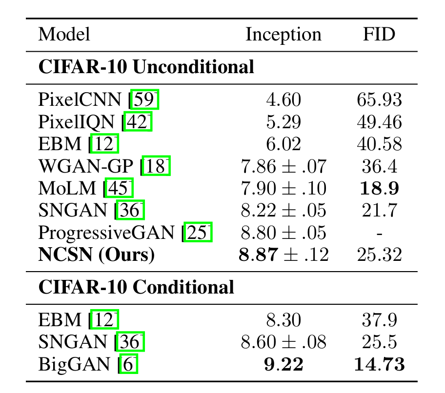

Score - Based Generative Modelling
===
<!-- ##### Generative modeling by estimating gradients of the data distribution.
Song, Yang, and Stefano Ermon. Advances in neural information processing systems 32 (2019). -->

<!-- centered headline only on this slide --> 
 

###### Manos Plitsis

---
 

# What is Generative Modelling?

Given a dataset $\{x_i \in \mathbb R^D\}_{i=1}^N$, model the *data distribution* $p_{data}(x)$.

Once we have $p(x)$ we can generate new data points by sampling from it.

---

# Energy-Based Modelling

To model an arbitrarily flexible distribution $p(x)$, we can model it as:
$$p_\theta(x)= \frac{e^{-f_\theta(x)}}{Z_\theta}$$

e.g. with maximum likelihood.

$f_\theta(x)$ is called the energy function
$Z_\theta=\int e^{-f_\theta(x)}$ is a normalizing constant

---
# Energy-Based Modelling

To model an arbitrarily flexible distribution $p(x)$, we can model it as:
$$p_\theta(x)= \frac{e^{-f_\theta(x)}}{Z_\theta}$$

e.g. with maximum likelihood. 
But Z is not tractable!

---

What if we could get rid of Z? If we instead model:

$$ 
\begin{align} 
\nabla_x log p_\theta(x) &= \nabla_x log ( \frac{e^{-f_\theta(x)}}{Z_\theta} ) \\
&= \nabla_x log ( \frac{1}{Z_\theta} ) +\nabla_x log ( e^{-f_\theta(x)} ) \\
&= - \nabla_x f_\theta(x) \\
&\approx s_\theta(x)

\end{align}
$$

---
# Score Networks

<!-- TODO: add image of score vector field for two gaussians -->

**Def.** The *(Stein) score* of a probability density $p(x)$ is $\nabla_x log p(x)$

A *score network* $s_\theta(x): \mathbb R ^D \to \mathbb R ^D$ is a neural network trained to approximate the score of $p_{data}(x)$ 

---

# Score Networks

**Def.** The *(Stein) score* of a probability density $p(x)$ is $s(x)=\nabla_x log p(x)$

A *score network* $s_\theta(x): \mathbb R ^D \to \mathbb R ^D$ is a neural network trained to approximate the score of $p_{data}(x)$ 

**Q1:** How do we learn $s_\theta(x)$?
**Q2:** How do we use it to generate new samples?

---

# Score Matching

**Q1.** How do we learn $s_\theta(x)$?
**A.** We optimize the score matching objective: 
$$L(\theta) \triangleq \frac{1}{2} \mathbb{E}_{p_{data}}[\|s_\theta(x) - s_{data}(x)\|^2_2]$$

---

# Score Matching

**Q1:** How do we learn $s_\theta(x)$?

**A:** We optimize the score matching objective: 
$$L(\theta) \triangleq \frac{1}{2} \mathbb{E}_{p_{data}}[\|s_\theta(x) - s_{data}(x)\|^2_2]$$

But we don't have access to $\nabla_x log p_{data}(x)$ !

can be shown equivalent (up to a constant) to: 
$$\mathbb{E}_{p_{data}(x)}[tr(\nabla_x s_\theta(x))+ \frac{1}{2}\|s_\theta(x)\|_2^2]$$

We can compute this from data, but calculating $tr(\nabla_x s_\theta(x))$ is too costly.

<!-- TODO add footnote with reference to 2005 paper with proof -->

---

# Score Matching

### Denoising Score Matching

We perturb the data with a noise distribution $q_\sigma(\tilde x | x)$, then estimate the score of $q_\sigma \triangleq \int q_\sigma(\tilde x | x)  p_{data}(x)dx$ with objective:

$$\frac{1}{2} \mathbb{E}_{q_{\sigma}(\tilde x|x)p_{\text{data}}(x)} [ \left\| s_{\theta}(\tilde x) - \nabla_{\tilde x} \log q_{\sigma}(\tilde x|x) \right\|^2_2]
$$

E.g. for Gaussian $\nabla _{\tilde x} \log q_\sigma(\tilde x | x) = - \frac{\tilde x - x} {\sigma^2}$

Then $s_{\theta *} (x) = \nabla_x \log q_\sigma (x)$ almost surely.

**But:** $s_{\theta *} (x) = \nabla_x \log q_\sigma (x) \approx \nabla_x \log p_{data} (x)$ only when $\sigma$ is small s.t. $q_\sigma (x) \approx p_{data} (x)$ (But not too small and the variance explodes)
 <!--TODO add sliced score matching slide  -->
---
# Langevin Dynamics

**Q2:** How do we use $s_\theta(x)$ to generate new samples?

**A:** We recursively compute:

$$
\tilde{x}_t = \tilde{x}_{t-1} + \frac{\epsilon}{2} \nabla_x \log p(\tilde{x}_{t-1}) + \sqrt\epsilon z_t
$$

where 
- $\epsilon>0$ a fixed step size
- $\tilde x_0 \sim \pi (x)$ with $\pi$ a prior distribution
- $z_t \sim \mathcal N (0, I)$

The distribution of $\tilde x_T$ approaches $p(x)$ when $\epsilon \to 0, T \to \infty$

---
# Langevin Dynamics

 
 
 
 
 
 
 
 
 
 
 

---

# Challenges of Score-Based Modelling

1) Data are concentrated on a low dimensional manifold
2) Scarcity of data leads to low density regions

---

# 1. The manifold hypothesis

Real world data tend to concentrate on **low dimensional manifolds** embedded in the ambient space.

- Score is undefined outside the manifold.
- Score matching only works when the support of $p(x)$ is the ambient space [Hyvärinen 2005]

<!-- Todo add pictures from paper -->

---

# 2. Scarcity of data

### Inaccurate score estimation

In practice, $\mathbb E_{p_{data}}$ is estimated using i.i.d. samples.

For regions $\mathcal R \subset \mathbb R^D$ s.t $p_{data}(\mathcal R) \approx 0$ there usually isn't enough data to estimate the score. 

---

---

# 2. Scarcity of data

### Slow mixing of Langevin Dynamics

Let $p_1(x),p_2(x)$ normalized distributions with disjoint support, and $p_{data}(x)=\pi p_1(x)+(1-\pi)p_2(x)$ , $\pi \in (0,1)$

The score does not depend on $\pi$, so samples with LD will not depend on $\pi$.

In practice, also true when supports are *approximately disjoint*.

---

<!--  -->
<!--  -->

---

# Noise Conditional Score Networks

## with Annealed Langevin Dynamics

#### Idea:

- Perturb data with various noise levels $\sigma_1,...,\sigma_L$ using distribution 
$$
q_\sigma(x) \triangleq \int p_{data}(t)\mathcal N (x | t, \sigma^2 I) dt
$$
(this gives $q_\sigma(\tilde x | x) = \mathcal N (\tilde x | x, \sigma^2 I)$, the "noising" distribution)
- Train a single conditional score network $s_\theta(x,\sigma)$ for all noise levels $\sigma_i$ to predict the noised data score $\nabla x \log q_{\sigma _i}(x)$ .
- In LD, start with high noise level scores, and gradually decrease the noise level.

---

# Noise Conditional Score Networks

- $\frac{\sigma_1}{\sigma_2} = ... = \frac{\sigma_{L-1}}{\sigma_L} \gt 1$
- $\sigma_1$ is large enough to avoid previous problems.
- $\sigma_L$ is small enough to minimize effect on data.

---
# Noise Conditional Score Networks

We defined $q_\sigma(\tilde x | x) = \mathcal N (\tilde x | x, \sigma^2 I)$, 
so $\nabla _{\tilde x} \log q_\sigma(\tilde x | x) = - \frac{\tilde x - x} {\sigma^2}$.

For a given $\sigma$:
$$
\ell(\theta; \sigma) \triangleq \frac{1}{2} \mathbb{E}_{p_{\text{data}}(x)} \mathbb{E}_{\tilde x \sim \mathcal{N}(x,\sigma^2 I)} \left[ \left\| s_{\theta}(\tilde x, \sigma) + \frac{\tilde{x} - x}{\sigma^2} \right\|^2_2 \right]
$$

So the final loss is:

$$
\mathcal{L}(\theta; \{ \sigma_i \}_{i=1}^L) \triangleq \frac{1}{L} \sum_{i=1}^L \lambda(\sigma_i) \ell(\theta; \sigma_i)

$$

---
# Noise Conditional Score Networks

How to choose $\lambda(\sigma)$?

- We want $\lambda(\sigma_i) \ell (\theta ; \sigma_i )$ to have the same order of magnitude for all $\{\sigma_i\}_{i=1}^L$.
- With optimally trained networks, we observe $\|s_\theta(x,\sigma)\|_2 \propto \frac{1}{\sigma}$.
- This inspires the choice $\lambda(\sigma) = \sigma^2$, leading to $\lambda(\sigma)\ell(\theta;\sigma) = \sigma^2 \ell(\theta;\sigma) = \frac{1}{2}\|\sigma s_\theta(x, \sigma) + \frac{\hat{x} - x}{\sigma}\|_2^2$.
- Given $\frac{\hat{x} - x}{\sigma} \sim \mathcal{N}(0, I)$ and $\|\sigma s_\theta(x, \sigma)\|_2 \propto 1$, the magnitude of $\lambda(\sigma)\ell(\theta;\sigma)$ does not depend on $\sigma$.

---

# Annealed Langevin Dynamics

$$

\begin{array}{r l}
\hline
&\textbf{Algorithm 1: Annealed Langevin dynamics} \\
\hline
\textbf{Require}: & \{ \sigma_i \}_{i=1}^L, \epsilon, T. \\
1: & \text{Initialize } \tilde x_0 \\
2: & \textbf{for } i = 1 \textbf{ to } L \textbf{ do} \\
3: & \quad \alpha_i \leftarrow \epsilon \sigma_i^2 / \sigma_L^2 \quad \text{ (} \alpha_i \text{ is the step size)} \\
4: & \quad \textbf{for } t = 1 \textbf{ to } T \textbf{ do} \\
5: & \quad \quad \text{Draw } z_t \sim \mathcal{N}(0, I) \\
6: & \quad \quad \tilde x_t \leftarrow \tilde x_{t-1} + \frac{\alpha_i}{2} s_\theta(\tilde x_{t-1}, \sigma_i) + \sqrt{\alpha_i} z_t \\
7: & \quad \textbf{end for} \\
8: & \quad \tilde x_0 \leftarrow \tilde x_T \\
9: & \textbf{end for} \\
10: & \textbf{return } \tilde x_T \\
\hline
\end{array}

$$

---
# Annealed Langevin Dynamics

How to choose $\alpha_i$?

- Many ways to tune $\alpha_i$. We use $\alpha_i \propto \sigma_i^2$.
- Aim: Fix the magnitude of the "signal-to-noise" ratio $\frac{\alpha_i s_{\theta}(x, \sigma_i)}{2\sqrt{\alpha_i}z}$ in Langevin dynamics w.r.t. $\sigma_i$.
- $\mathbb{E}\left[\|\frac{\alpha_i s_{\theta}(x, \sigma_i)}{2\sqrt \alpha_i z}\|^2_2\right] \approx \mathbb{E}\left[\frac{\alpha_i\| s_{\theta}(x, \sigma_i)\|^2_2}{4}\right] \propto \frac{1}{4}\mathbb{E}\left[\|\sigma_i s_{\theta}(x, \sigma_i)\|^2_2\right]$.
- Empirically, when networks are optimally trained, $\|s_{\theta}(x, \sigma_i)\|_2 \propto \frac{1}{\sigma_i}$.
- Thus $\mathbb{E}\left[\|\sigma_i s_{\theta}(x, \sigma_i)\|^2_2\right] \propto 1$.
- Therefore, the choice of $\alpha_i$ does not depend on $\sigma_i$.

---

---

# Experimental Setup

- $L=10$
- $\{ \sigma_i \}_{i=1}^L$ is a geometric sequence with:
    - $\sigma_1=\sigma_{max}=1$
    - $\sigma_{10}=\sigma_{min}=0.01$
- For LD sampling:
    - $T=10$
    - $\epsilon=2\times 10^-5$
    - Initial samples are uniform noise.

---

# Results 
 
 
 
 
 
 
 
 
 
 
 
 

<!--  -->

---

# NCSM vs DDPM

### Reminder: DDPM
- $q(x_t \vert x_{t-1}) = \mathcal{N}(x_t; \sqrt{\alpha_t}x_{t-1}, (1-\alpha_t) I)$ (noising step)
- $p_{\theta}(x_T) = \mathcal{N}(x_T; 0, I).$
- $p_{\theta}(x_{t-1}|x_t) = \mathcal{N}(x_{t-1}; \mu_{\theta}(x_t,t), \sigma(x_t,t)^2 I)$ (denoising step)

 

---

# NCSM vs DDPM

### ELBO for DDPM

$$
\begin{align}
\log p(x) &\geq 
\mathbb{E}_{q(x_1|x_0)}  
\left[ 
\log  p_{\theta}(x_0|x_1)
\right] && (L_0:\text{ Reconstruction term})\\
&-
D_{KL}(q(x_T|x_0) || p(x_T)) && (L_T:\text{Prior matchng term}) \\

&-
\sum_{t=2}^T  \mathbb{E}_{q(x_t|x_0)}
\left[
D_{KL}(q(x_{t-1}|x_t, x_0) || p_{\theta}(x_{t-1} | x_t))
\right]
&& (L_{t-1}:\text{Denoising matching term}) \\

\end{align}
$$

To **maximize** the ELBO, we need to minimize the denoising matching term.

---
We can write $x_t = \sqrt{\bar{a_t}}x_0 + \sqrt{1-\bar{a_t}}\epsilon_0 \sim \mathcal N (x_t; \sqrt{\bar a_t}x_t, (1-\bar a_t)I)$ 

with $\bar{a}_t = \prod\limits_{i=1}^t a_i$

Then:

$$
\begin{align}
q(x_{t-1}|x_t,x_0) &= \frac{q(x_t|x_{t-1},x_0) q(x_{t-1}|x_0)}{q(x_t|x_0)} \;\;\;\;\; \text{(Bayes rule)} \\
&= \frac{\mathcal{N}(x_t; \sqrt{\bar a_t}x_t, (1-\bar a_t)I) \; \; \mathcal{N}(x_{t-1}; \sqrt{\bar{a}_{t-1}}x_0, (1-\bar{a}_{t-1}) I ) }{\mathcal{N}(x_{t}; \sqrt{\bar{a}_t}x_0, (1-\bar{a}_t) I )} \\
&= \; \; ...  \\

&= \mathcal{N}(x_{t-1};
\underbrace{\frac{\sqrt{a_t} (1-\bar{a}_{t-1})x_t + \sqrt{\bar{a}_{t-1}}(1-a_t)x_0}
{1- \bar{a}_t}}_{\mu_q(x_t,x_0)},
\underbrace{\frac{(1-a_t) (1-\bar{a}_{t-1})}{(1-\bar{a}_t)}I}_{\sum_q(t)}
)
\end{align}
$$

---

<!-- # NCSM vs DDPM -->
# Learning $μ_\theta$
$$
\begin{align}
&\text{argmin}_{\theta} \; D_{KL}(q(x_{t-1}|x_t, x_0) \; || \; p_{\theta}(x_{t-1} | x_t)) \\
= \; &\text{argmin}_{\theta} \; D_{KL}(\mathcal{N}(x_{t-1}; \mu_q(t), \Sigma_q(t)) \; || \;  \mathcal{N}(x_{t-1}; \mu_{\theta}(t), \Sigma_{q}(t))) && \text{(set denoising transition variance to be $Σ_q(t)$)} \\   
= \; & \;\; . . . && (\text{KL Divergence Gaussians}) \\
= \; &\text{argmin}_{\theta} \; \frac{1}{2\sigma_q^2(t)} 
\left[
|| \mu_{\theta} - \mu_q||_2^2
\right]
\\ 

\end{align}
$$

---
# Learning $\epsilon_\theta$

We can choose the parameterization: $x_0 = \frac
  {x_t + \sqrt{1-\bar{a}_t}\epsilon_0}
  {\sqrt{\bar{a}_t}}$

- $
\mu_q(x_t, x_0) = 
\frac{1}{\sqrt{a_t}}x_t -\frac{1-a_t}{\sqrt{1-\bar{a}_t} \sqrt{a}_t} \mathbin{\color{green}\epsilon_0}
$

- $
\mu_{\theta}(x_t, t) = 
\frac{1}{\sqrt{a_t}}x_t -\frac{1-a_t}{\sqrt{1-\bar{a}_t} \sqrt{a}_t} 
\mathbin{\color{green}\epsilon_{\theta}(x_t,t)}
$

Reformulate the loss to:

$
\text{argmin}_{\theta} = 
\frac
{(1-a_t)^2}
{\underbrace{2\sigma_q^2(t) (1-\bar{a}_t)a_t}_{\lambda_t}}
\left[
||e_0 - e_{\theta}(x_t,t)||_2^2
\right]
$

---

# Learning $\nabla_x log p_{\theta}(x)$

Given a Gaussian variable $z \sim \mathcal{N}(z; \mu_z, \Sigma_z)$, Tweedie's Formula states:

$$
\mathbb{E}[\mu_z|z] = z + \Sigma_z \nabla_z \log p(z)
$$

From a known equation, we have:

$$
q(x_t|x_0) = \mathcal{N}(x_t; \sqrt{\alpha_t}x_0, (1 - \alpha_t)I)
$$

By Tweedie's Formula, we get:

$$
\mathbb{E}[\mu_{x_t}|x_t] = x_t + (1 - \alpha_t) \nabla_{x_t} \log p(x_t)

$$

The best estimate for the true mean $\mu_{x_t} = \sqrt{\alpha_t}x_0$, is:

$$
\sqrt{\alpha_t}x_0 = x_t + (1 - \alpha_t) \nabla_{x_t} \log p(x_t)

$$

$$
\Rightarrow x_0 = x_t + \frac{(1 - \alpha_t)}{\sqrt{\alpha_t}} \nabla_{x_t} \log p(x_t)

$$

---

# Learning $\nabla_x log p_{\theta}(x)$

Remember, $\mu_q(x_t,x_0)=\frac{\sqrt{a_t} (1-\bar{a}_{t-1})x_t + \sqrt{\bar{a}_{t-1}}(1-a_t)\mathbin{\color{red}x_0}}
{1- \bar{a}_t} = \frac{\sqrt{a_t} (1-\bar{a}_{t-1})x_t + \sqrt{\bar{a}_{t-1}}(1-a_t)\mathbin{\color{red}(x_t + \frac{(1 - \alpha_t)}{\sqrt{\alpha_t}} \nabla_{x_t} \log p(x_t))}}
{1- \bar{a}_t}$

- $
\mu_q(x_t, x_0) = 
\frac{1}{\sqrt{a_t}}x_t -\frac{1-a_t}{ \sqrt{a}_t} \mathbin{\color{green}\nabla_{x_t} \log p(x_t)}
$

- $
\mu_{\theta}(x_t, t) = 
\frac{1}{\sqrt{a_t}}x_t -\frac{1-a_t}{ \sqrt{a}_t} \mathbin{\color{green}s_\theta(x_t,t)}
$

Reformulate the loss to:

$
\text{argmin}_{\theta} = 
\frac
{(1-a_t)^2}
{2\sigma_q^2(t) a_t}
\left[
||s_\theta(x_t,t) - \nabla_{x_t} \log p(x_t)||_2^2
\right]
$

---

# The score looks like $\epsilon_0$ (?!)

$$
x_0 = \frac
{x_t + \sqrt{1-\bar{a}_t}\epsilon_0}
{\sqrt{\bar{a}_t}} =
x_t + \frac{(1 - \alpha_t)}{\sqrt{\alpha_t}} \nabla_{x_t} \log p(x_t)
$$

$$
\Rightarrow \nabla_{x_t} \log p(x_t) = - \frac{1}{\sqrt{1-\bar \alpha_t}} \epsilon_0
$$